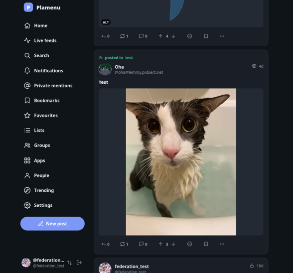

# Plamenu

**An experimental ActivityPub server written in Rust**



> [!WARNING]
> Plamenu is experimental. Database and configuration compatibility between
> experimental releases is not guaranteed.
> Do not use it yet for a production-critical community, and keep tested
> independent backups.

> [!WARNING]
> Currently, Plamenu is being developed with LLM assistance. Nobody is particularly proud of that fact, but it wouldn't exist otherwise.
> Once either the active prototyping phase is over or a community capable of maintaining and developing the project emerges, we hope to stop relying on AI-powered tools for writing code, limiting their use to security reviews and additional QA.
> Whether that's possible or not, only time will tell.

Plamenu has a built-in web interface and a Mastodon-compatible client API.
Its compatibility target is Mastodon 4.7.1.

## Features

- Timelines, follows, replies, quotes, boosts, favourites, bookmarks, emoji
  reactions, lists, filters, and notifications.
- Posts with media, polls, content warnings, visibility controls, scheduling,
  and edits. The web composer accepts plain text, Markdown, and HTML.
- Experimental groups with titled discussion and link posts, long-form
  articles, events, and Webxdc app sessions.
- Account import/export, follower migration, two-factor authentication,
  reporting, and moderation tools.
- Extended compatibility with PeerTube and Owncast, including support for watching livestreams.

See [posting](https://docs.plamenu.codefloe.page/members/posting.html) for the controls available in the web client.

## Running a server

Plamenu uses PostgreSQL and local media storage. Background workers run in the
server process. Run one `plamenu serve` process per database.
The public domain and optional separate handle domain are permanent
once accounts federate.

The repository includes deployment examples for a Linux binary with systemd,
PostgreSQL, and Caddy, and an OCI image with Docker Compose. The release pipeline
produces signed Linux AMD64 and ARM64 installation archives and one
multi-architecture OCI image.

- [Releases and binary downloads](https://codefloe.com/plamenu/plamenu/releases)
- [OCI images](https://codefloe.com/plamenu/-/packages)
- [Installation](https://docs.plamenu.codefloe.page/start/install.html)
- [Configuration, backups, upgrades, and troubleshooting](https://docs.plamenu.codefloe.page/operators/index.html)
- [Documentation](https://docs.plamenu.codefloe.page/)
- [Federation](https://docs.plamenu.codefloe.page/federation/protocol.html)
- [Known issues](https://docs.plamenu.codefloe.page/KNOWN_ISSUES.html)

To build, test, and publish from source, see the
[release procedure](https://docs.plamenu.codefloe.page/RELEASING.html).

## Development

```sh
cp .env.example .env
./dev doctor
./dev up
```

See the [development guide](https://docs.plamenu.codefloe.page/DEVELOPMENT.html) for dependencies and checks,
and [contribution guide](https://docs.plamenu.codefloe.page/contributing/index.html) for contributions. The main repository is
[codefloe.com/plamenu/plamenu](https://codefloe.com/plamenu/plamenu).

Report vulnerabilities privately using [security policy](https://docs.plamenu.codefloe.page/reference/security.html).
For other questions and bug reports, see [Getting help](https://docs.plamenu.codefloe.page/reference/getting-help.html).

## License

[GNU Affero General Public License v3.0 only](LICENSE).
